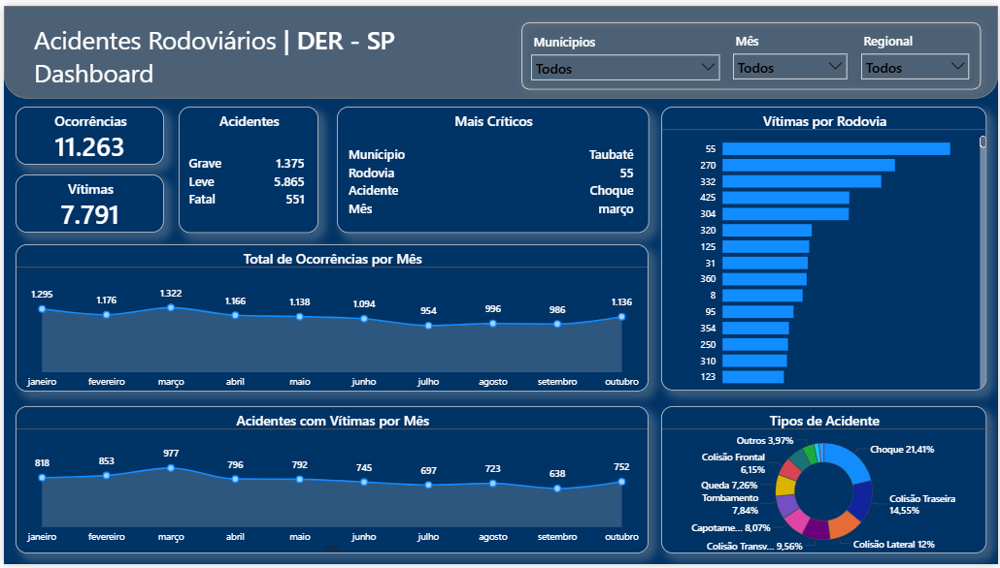
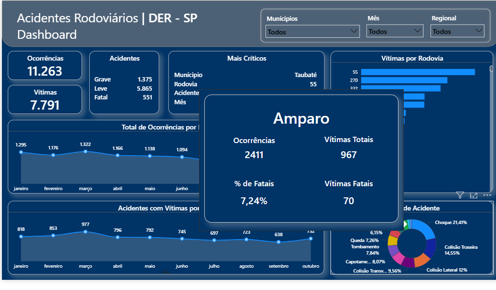

# 🚦 Dashboard de Acidentes Rodoviários – DER (2025)

Este projeto apresenta um dashboard interativo desenvolvido em Power BI para análise de acidentes rodoviários no estado de São Paulo, com base em dados do DER-SP e do sistema Infosiga-SP.

## 🎯 Objetivo

Monitorar, visualizar e identificar padrões críticos de acidentes em rodovias paulistas, oferecendo suporte à tomada de decisão para políticas públicas de segurança viária.

## 📊 Funcionalidades

- **Indicadores principais**: Total de ocorrências, vítimas, tipos de vítimas.
- **Análise temporal**: Evolução mensal de acidentes e vítimas.
- **Classificação por tipo de acidente**: Choque, colisões, tombamento, capotamento, etc.
- **Ranking por rodovia e município**: Identificação de trechos mais críticos.
- **Tooltip inteligente**: Informações detalhadas por rodovia e tipo de acidente.
- **Filtros dinâmicos**: Segmentação por município, mês e regional.

## 🧠 Destaques analíticos

- Identificação do **KM crítico** por rodovia.
- Cálculo do **percentual de acidentes fatais** por localidade.
- Painel “Mais Críticos” com os principais fatores de risco.
- Layout institucional com paleta de cores inspirada no DER-SP.

## 🛠️ Tecnologias Utilizadas

- **Power BI** → construção do dashboard interativo  
- **DAX** → criação de medidas e cálculos personalizados  
- **Power Query (M)** → tratamento e transformação dos dados
- **GitHub** → versionamento e publicação do projeto  

## 📷 Screenshots

Tela principal:  

Tooltip de rodovia:  

Tooltip de tipo de acidente:  

## 📌 Aplicações

- Apoio à gestão pública de segurança viária.  
- Estudos técnicos para engenharia de tráfego.  
- Comunicação institucional com dados confiáveis.  
- Base para análises preditivas e geográficas. 

## 📝 Conclusão
Este dashboard oferece uma visão estratégica dos acidentes rodoviários registrados pelo DER, permitindo ações preventivas, decisões baseadas em dados e apoio à segurança pública.
O projeto foi desenvolvido como parte dos meus estudos em Ciências de Dados, com o objetivo de treinar e aprimorar minhas habilidades em Power BI. Além de servir como exercício prático,
ele demonstra como a análise de dados pode ser aplicada em problemas reais, contribuindo para insights relevantes na área de segurança viária.

## 📬 Contato

Desenvolvido por **Jaqueson Alves**  
📧 [jaquesonalves@hotmail.com]  
🔗 [LinkedIn](https://www.linkedin.com/in/ajcordeiro)  
💻 [GitHub](https://github.com/ajcordeiro)

